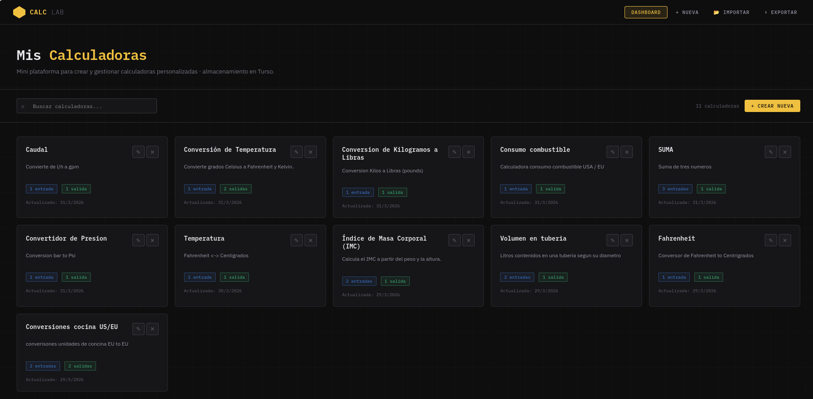

# Presentacion Calculadoras WEB

## Calculadoras
Se ha liberado la versio 1.0 de la web, CalcuLab, una micro plataforma donde puedes crear tus propias calculadoras, de formas sencilla.
En esta version, se permite crear nuevas calculadoras, con el numero de entradas que sean necesarias, luego se define u o mas salidas.
Estas salidas se introduce la formula, usando JavaScript. 
Las calculadoras quedan guardadas y accesibles para todos los usuarios.

[CaluLab](http://valtic.surge.sh/calclab-turso)

<!-- Imagen local almacenada en src/assets/ -->
<!-- Usa una ruta de archivo relativa o un alias de importación -->

[blue]*Existe la verison de guardarlas en local.*
En esta version la infomracion de las calculadoras se guarda en credenciales locales.
[CalcuLaba Local](http://valtic.surge.sh/calclab)
TODO: Funcion exportar/Importar la informacion a JSON, para rescatarla a otro navegador.
